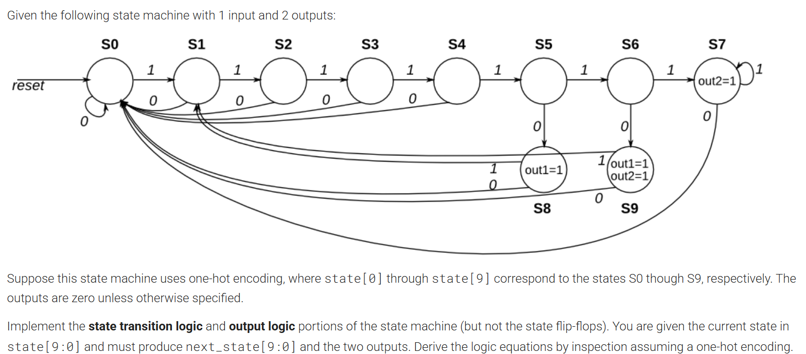
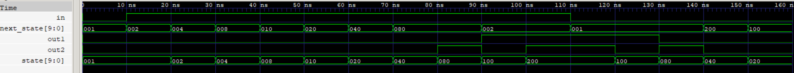
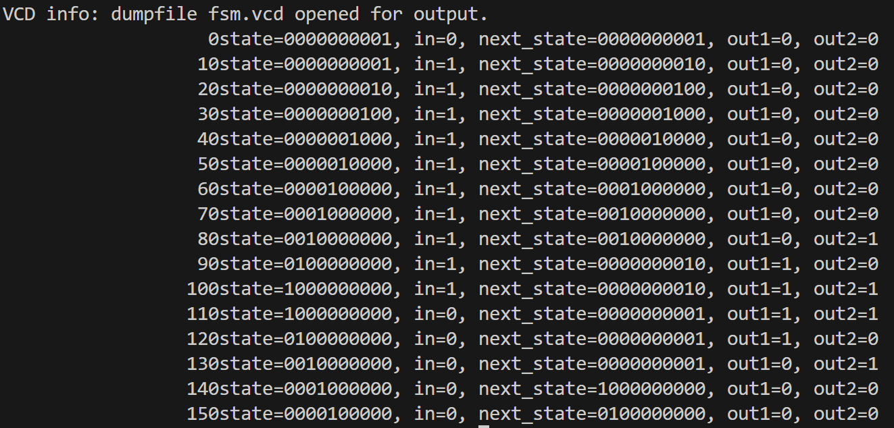

# One-hot FSM

A visual and practical demonstration of a One-hot Finite State Machine (FSM).

---

## Problem Statement

---

## FSM State Graph

---

## Output Example

---

Feel free to explore the images above for a clear understanding of the FSM design and its output!